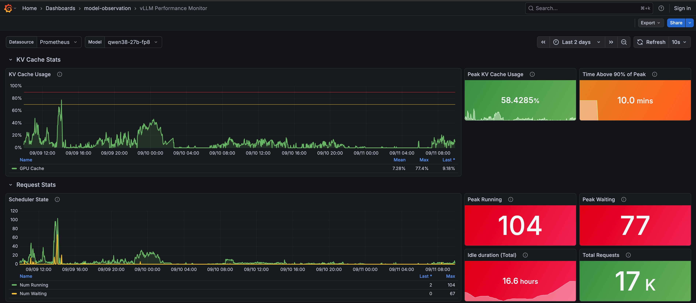

# vLLM Performance Dashboard

Grafana dashboard for monitoring vLLM on OpenShift: KV cache usage, request scheduling, token throughput and latency.



## Dashboard sections

- **KV Cache Stats:** Cache utilisation, peak usage and time spent near the peak.
- **Request Stats:** Running, waiting and swapped requests, peak counts, idle time and completed requests.
- **Token Throughput:** Prompt and generated token rates, totals, peaks and average generation speed per request.
- **Latency Overview:** End-to-end latency, time to first token and latency compared with cache utilisation.

## Prereqs

- Grafana Operator >=5.24.0
- [User Workload Monitoring enabled](https://docs.redhat.com/en/documentation/monitoring_stack_for_red_hat_openshift/4.20/html/configuring_user_workload_monitoring/index) on the OpenShift monitoring stack.

## Deploy

> ⚠️ **WARNING: Review the [Grafana CR](./deploy/grafana.yaml) carefully. It currently allows [anonymous viewer access](./deploy/grafana.yaml#15).**

* Change the admin user credentials in [`grafana.yaml`](./deploy/grafana.yaml#24).

* Create the Namespace, Grafana CR, Datasource and Dashboard.

```sh
oc apply -k deploy/
```

* Create a ServiceAccount, ClusterRoleBinding and Secret to be used to retrieve the metrics.

```sh
oc create serviceaccount grafana-prometheus-reader -n model-observation

oc adm policy add-cluster-role-to-user cluster-monitoring-view \
    -z grafana-prometheus-reader -n model-observation

oc apply -n model-observation -f - <<'EOF'
apiVersion: v1
kind: Secret
metadata:
  name: prometheus-token-secret
  namespace: model-observation
  annotations:
    kubernetes.io/service-account.name: grafana-prometheus-reader
type: kubernetes.io/service-account-token
EOF
```

## Verify

* Retrieve Grafana hostname.

```sh
oc get route grafana-route -n model-observation -ojsonpath="{.spec.host}"
```

* Go to **Grafana > Dashboards > model-observation > vLLM Performance Monitor**

> Note: It may take a few minutes for the dashboard to appear.

* Select your Prometheus data source and model.

* Look at metrics :D